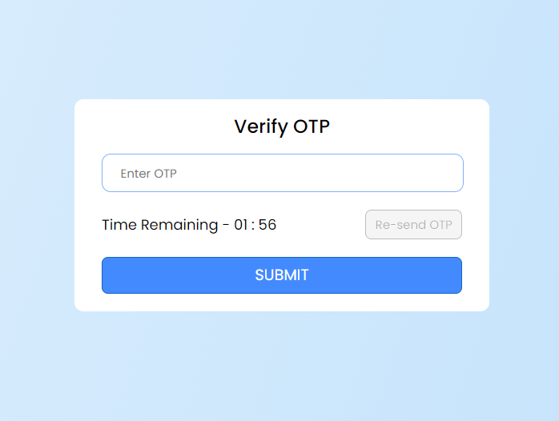

<h1>OTP Countdown Timer App</h1>

This is a simple OTP (One-Time Password) countdown timer app built using React. It provides a countdown timer that starts from a predefined time (e.g., 1 min, 59 sec) and counts down to 0, allowing users to resend OTP after the timer expires.

<h2>Features</h4>

<ul>
  <li>Start countdown timer from a predefined time.</li>
  <li>Display remaining time in minutes and seconds.</li>
  <li>Enable/disable the "Resend OTP" button based on the countdown timer.</li>
</ul>

<h2>Technologies Used</h2>

<ul>
  <li>React</li>
   <li>JavaScript</li>
   <li>HTML/CSS</li>
</ul>
